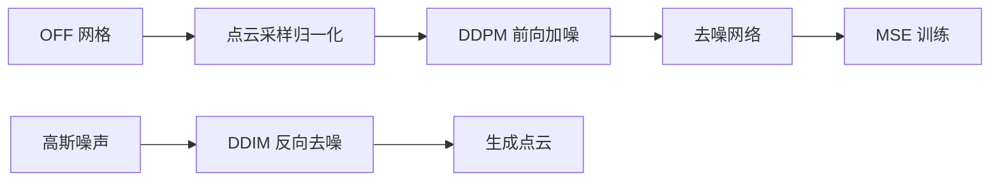

王瑞 王思明 几何计算前沿 Final-Project
# 基于点云的三维扩散模型 — Milestone 阶段报告

---

## 一、项目概述

本项目名称为「基于点云表达的原生三维 DDPM 形状无条件生成」，目标是直接使用三维数据训练扩散模型，从随机噪声迭代去噪生成全新的三维点云形状。技术路线参考 Point-E 的点云扩散思路，自行实现数据处理、扩散模块与训练流程。数据方面使用 ModelNet40，当前以 `airplane` 类别为主，后续计划扩展至其它多个类别。

阶段目标分为两部分：**基础任务**是实现单类别（airplane）的无条件点云生成，跑通「数据 → 训练 → 采样 → 可视化」完整链路；**拓展任务**是在此基础上尝试多类别条件生成。

---

## 二、选题背景

### 2.1 应用需求

游戏、AR/VR、数字孪生、工业建模等领域需要大量三维数字资产。传统人工建模周期长、成本高，基于深度学习的自动 3D 生成可批量产出几何形状，具有较高实用价值。

### 2.2 现有技术痛点

| 路线 | 主要问题 |
|------|----------|
| 3D-GAN | 易模式崩溃，细节与多样性不足 |
| NeRF 类方法 | 训练与渲染开销大，难以直接生成可编辑几何 |
| 2D 扩散重建 3D | 间接生成，多视角不一致，几何穿模、拓扑不稳定 |

### 2.3 本项目技术选型

作业要求「使用三维数据直接训练、生成时将噪声去噪为三维形状」。**原生 3D 扩散**在点云、体素或三平面等三维表征上执行完整加噪—去噪流程，直接学习 XYZ 空间几何约束，与作业目标一致。

经对比点云、体素 SDF、Triplane 三类表征，综合考虑显存、实现难度与复现成本，本项目选用**无序点云**作为三维载体，参考 Point-E 的点云扩散框架，在单张消费级 GPU 上即可完成训练。

---

## 三、核心方法

### 3.1 DDPM 扩散原理

扩散模型包含两个过程：

1. **前向加噪（训练用，固定公式）**  
   以干净样本 $x_0$ 为起点，分 $T$ 步逐步叠加高斯噪声，直至 $x_T$ 近似纯随机噪声：
   $$x_t = \sqrt{\bar\alpha_t}\, x_0 + \sqrt{1-\bar\alpha_t}\,\epsilon, \quad \epsilon \sim \mathcal{N}(0, I)$$

2. **反向去噪（生成用，神经网络学习）**  
   网络 $\epsilon_\theta(x_t, t)$ 预测所加噪声，训练目标为 MSE：
   $$\mathcal{L} = \mathbb{E}_{x_0, \epsilon, t}\big[\|\epsilon - \epsilon_\theta(x_t, t)\|^2\big]$$  
   推理时从 $x_T \sim \mathcal{N}(0,I)$ 出发，迭代去噪得到新形状 $x_0$。

### 3.2 点云表征与网络结构

每个三维模型表示为 $N=2048$ 个表面采样点，即 $N \times 3$ 的坐标矩阵。前向扩散对每个点的 $(x,y,z)$ 坐标独立叠加高斯噪声；去噪网络采用 PointNet 式 MLP，结合全局 max-pool 融合与时间步正弦嵌入。噪声调度使用 Cosine $\beta$ schedule，扩散步数 $T=1000$；训练以预测噪声与真实噪声的 MSE 为损失。推理阶段采用 DDIM 采样（默认 50 步），输出 `.npy` / `.ply` 格式点云。

网络输入为带噪点云 $x_t \in \mathbb{R}^{B \times N \times 3}$ 与时间步 $t \in \{0,\ldots,T-1\}$，输出为与点云同形状的预测噪声 $\hat\epsilon \in \mathbb{R}^{B \times N \times 3}$。

### 3.3 数据处理流程

```
ModelNet40 OFF 网格
  → 表面均匀采样 + FPS 降至 2048 点
  → 中心化并归一化至单位球
  → 训练时随机 Y 轴旋转、小幅缩放增强
  → 缓存至 data/ModelNet40/_cache/ 加速后续训练
```

### 3.4 技术流水线



### 3.5 参考文献对应

- **Point-E**：点云扩散、归一化与采样策略、条件生成拓展思路（核心参考）
- **SDFusion**：SDF 隐式场潜扩散（备选对比，可用于最终报告消融讨论）

## 四、当前进展

### 4.1 已完成工作

目前已完成选题与方案设计，确定采用点云 + DDPM 路线并完成文献调研。ModelNet40 数据集已下载，`airplane` 类别可用于训练。点云预处理模块已实现 OFF 读取、表面采样、FPS 降采样、归一化、缓存及数据增强。扩散方面完成了 Cosine 调度的 DDPM 模块，包含前向加噪与 MSE 训练损失。去噪网络初版采用 PointNet 式结构并融合时间步嵌入。`train.py` 支持 YAML 配置与 checkpoint 保存，`sample.py` 支持 DDIM 采样并输出 PLY/NPY 格式。本地 PyTorch + CUDA 环境已搭建，训练与推理链路均已验证可运行。

### 4.2 初步实验结果

在 `airplane` 类别上完成了 1 epoch 冒烟训练（`batch_size=8`，CUDA）。单个 epoch 耗时约 $6.4$ 分钟（共 78 个 batch，含首次 mesh 采样缓存开销）。训练 loss 由约 $1.0$ 降至 epoch 平均 $0.717$。

1 个 epoch 仅为流程验证，生成质量有限；完整训练目标为 200 ~ 500 epoch，并观察 loss 收敛与生成形状。

### 4.3 当前局限

1. 当前尚未完成充分的训练，生成点云尚未呈现清晰飞机结构，还未能验证生成模型的有效性
2. 当前去噪网络采用简化 PointNet，表达能力弱于 Point Transformer，计划后续升级
3. 定量评估（CD、EMD 等）与训练日志尚未接入
4. 仅完成 `airplane` 单类，后续考虑对其它类别进行训练

---

## 五、后续计划与可能拓展

1. **充分训练**：对 `airplane` 完成 200～500 epoch 训练，调优 batch size 与学习率，以达到较良好的生成效果
2. **网络升级**：考虑另外采用 Point Diffusion Transformer 实现去噪，对比当前去噪方法的生成效果
3. **评估体系**：实现 Chamfer Distance 等定量指标；定性对比真实样本与生成样本
4. **消融实验**：采样点数（2048 / 4096）、DDIM 步数（50 / 100）对生成质量的影响
5. **多类别条件生成**：接入多个类别数据，增加类别 embedding，实现指定类别可控生成
6. **文本条件生成**：如有可能，参考 Point-E 接入 CLIP 文本编码器引导生成